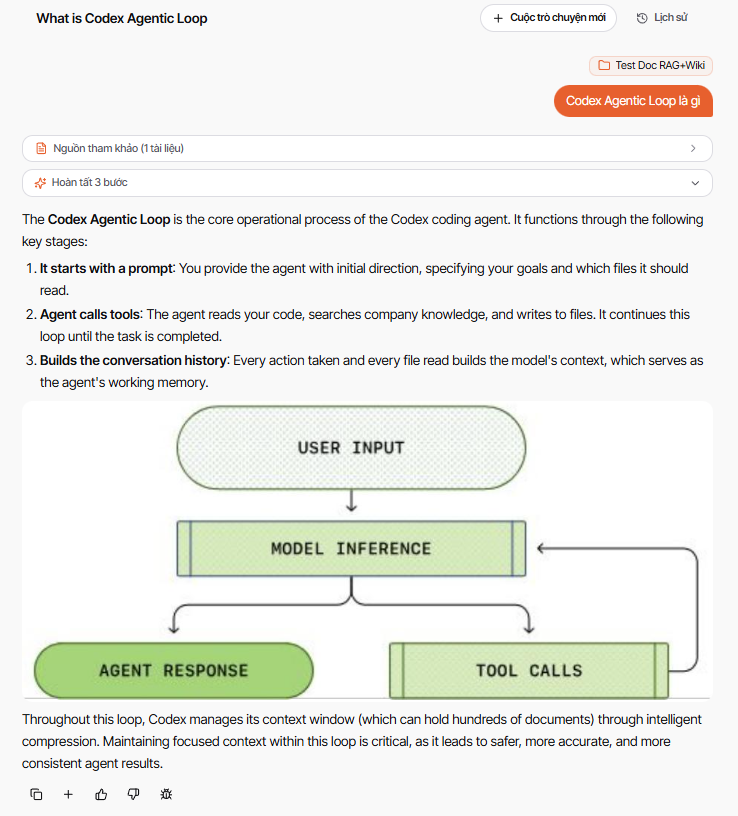

# Kiểm thử hình ảnh trong câu trả lời chat

Mã dữ liệu kiểm thử: `AUDIT-IMAGE-20260806`.

Codex Agentic Loop là một chu trình gồm bốn thành phần chính: đầu vào của người dùng, suy luận của mô hình, lời gọi công cụ và phản hồi của agent. Sau mỗi lượt gọi công cụ, kết quả quay lại mô hình để tiếp tục suy luận cho đến khi nhiệm vụ hoàn tất.

Hình trên minh họa luồng từ **User Input** đến **Model Inference**, sau đó tách sang **Tool Calls** hoặc **Agent Response**. Nhánh Tool Calls quay lại Model Inference để tạo thành vòng lặp.

## Câu hỏi dùng để kiểm thử

Hỏi: “Mã AUDIT-IMAGE-20260806 mô tả vòng lặp nào? Hãy trả lời kèm hình minh họa.”

Kết quả đạt yêu cầu khi câu trả lời lấy đúng nội dung ở tài liệu này và hiển thị hình sơ đồ, không chỉ mô tả hình bằng chữ.

