# Nhật ký kiểm chứng Google Drive connector - 07/08/2026

**Trạng thái:** bước xác thực, chọn tài nguyên, cấu hình chiến lược và lượt đồng bộ đầu tiên đã quan sát thành công.  
**Phạm vi:** một KB Tài liệu và một thư mục My Drive do người dùng vận hành; không ghi service-account JSON/private key.  
**Nguồn đối chiếu:** `so-tay-tao-knowledge-base-v3.md`, module 08.

## 1. Chuỗi thao tác đã kiểm chứng

1. Tạo service account riêng trong Google Cloud.
2. Tạo JSON key từ tab **Keys**; key do Google sinh, không thêm thủ công.
3. Chia sẻ thư mục My Drive cho email service account với quyền **Viewer**.
4. Bật **Google Drive API** trong đúng project Google Cloud.
5. Trong Knowledge VNG, chọn Google Drive, dán toàn bộ service-account JSON và để trống Shared Drive ID vì nguồn nằm ở My Drive.
6. Kiểm tra kết nối, chọn tài nguyên, cấu hình chiến lược và bấm **Tạo & đồng bộ ngay**.

Không có ảnh nào trong audit chứa trường `private_key`, `private_key_id` hoặc nội dung JSON key.

## 2. Xác thực và lỗi đã gặp

Màn hình xác thực yêu cầu tên connector, toàn bộ service-account JSON và Shared Drive ID tùy chọn:

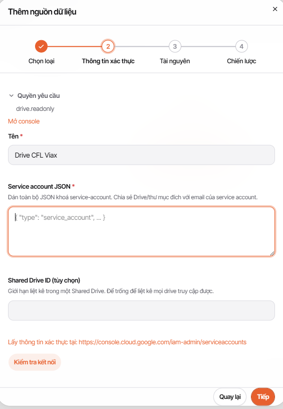

Service account được chia sẻ thư mục với quyền **Viewer**:

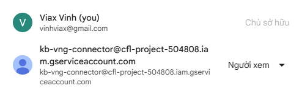

Lần kiểm tra đầu trả về `connection validation failed` vì Google Drive API chưa được bật:

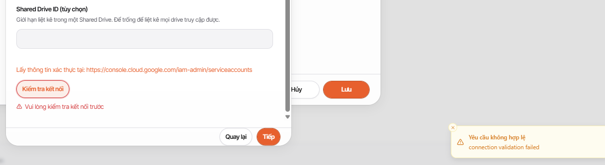

Sau khi bật Drive API trong đúng project, connector đi tiếp được đến bước Tài nguyên. Đây là nguyên nhân gốc đã được xác nhận; không cần tạo lại service account hoặc JSON key.

## 3. Bước Tài nguyên

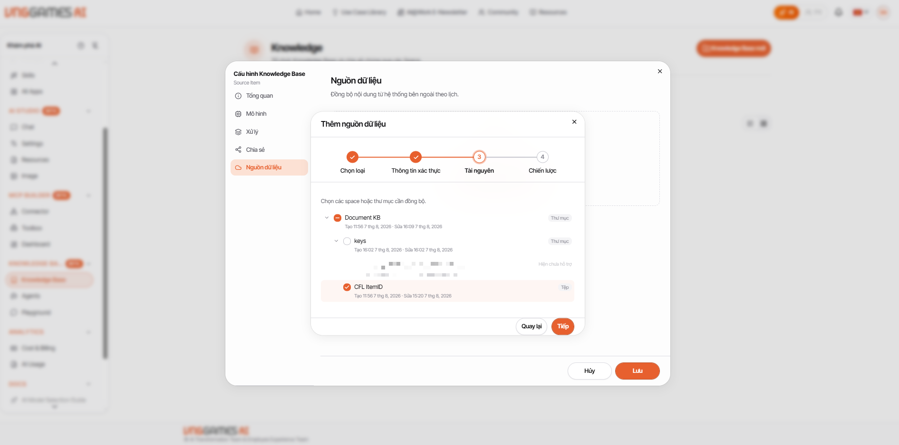

Quan sát được:

- Hiển thị cây thư mục và tệp mà service account có quyền đọc.
- Có thể chọn một tệp riêng hoặc chọn thư mục.
- Dấu trừ màu cam ở thư mục cha biểu thị chỉ một phần con được chọn.
- Một số mục hiện nhãn **Hiện chưa hỗ trợ**.
- Trong lượt test, một tệp được chọn; không chọn thư mục `keys`.

## 4. Bước Chiến lược

### Lịch, chế độ và xung đột

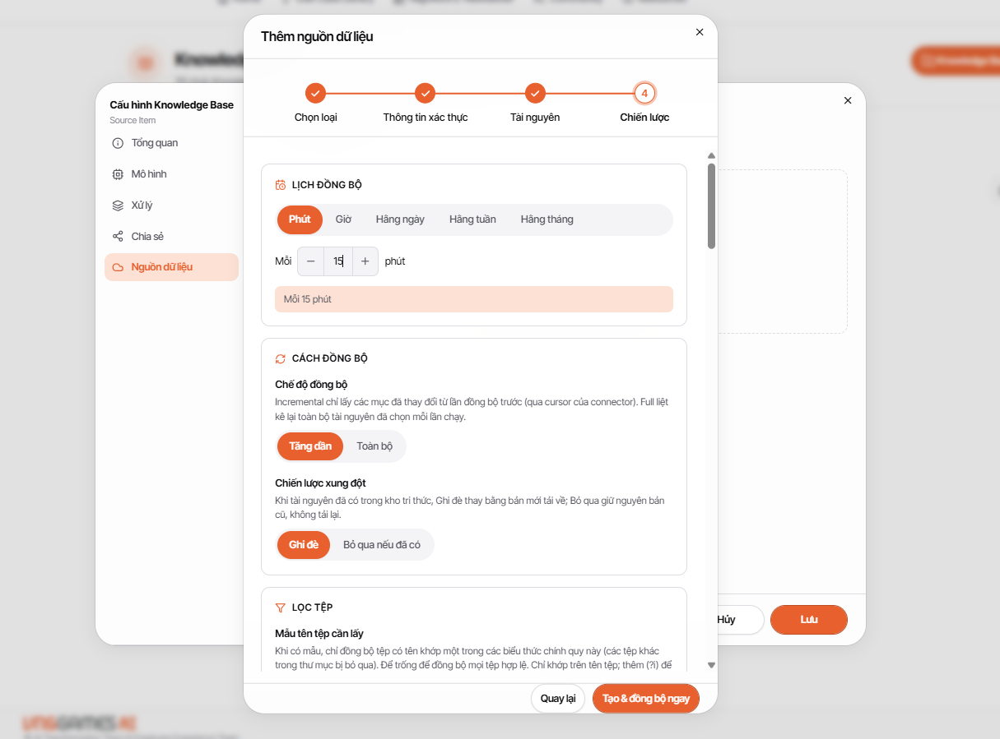

- Lịch có các đơn vị: phút, giờ, hằng ngày, hằng tuần, hằng tháng.
- Chế độ: **Tăng dần** hoặc **Toàn bộ**.
- Xung đột khi tài nguyên đã tồn tại: **Ghi đè** hoặc **Bỏ qua nếu đã có**.
- Lượt test dùng Tăng dần, Ghi đè và mỗi 15 phút.

### Lọc tệp và tag

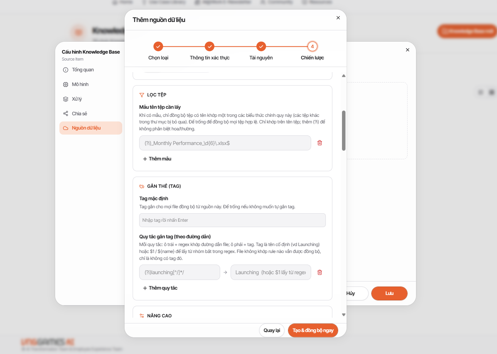

- Có thể thêm nhiều regex tên tệp; tệp khớp một trong các mẫu được đồng bộ.
- Để trống mẫu để nhận mọi tệp hợp lệ trong phạm vi đã chọn.
- Có tag mặc định và rule gắn tag theo đường dẫn; rule hỗ trợ capture từ regex.

### Ghi đè xử lý và parser

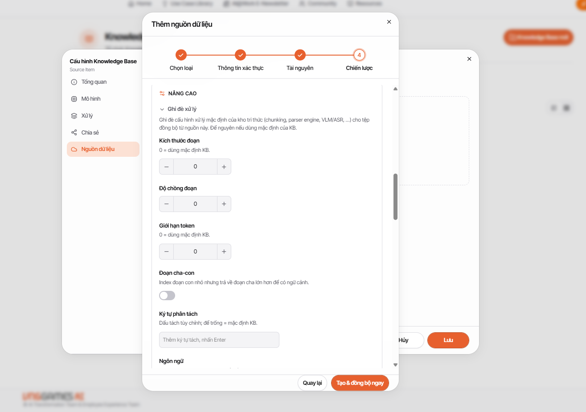

Các giá trị `0` ở kích thước đoạn, độ chồng đoạn và giới hạn token dùng mặc định KB. Cùng nhóm còn có đoạn cha-con, ký tự phân tách và ngôn ngữ.

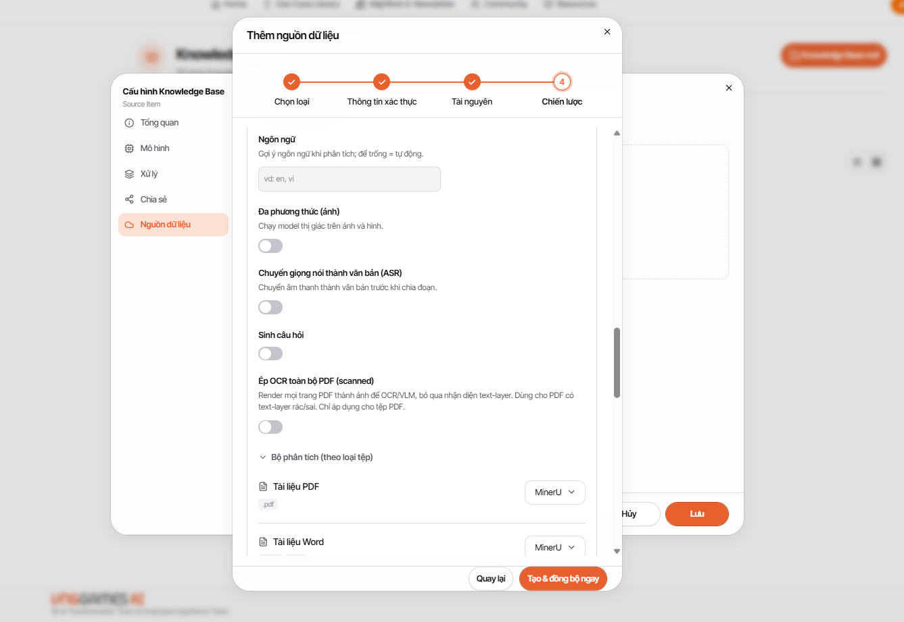

Quan sát được các toggle đa phương thức ảnh, ASR, sinh câu hỏi, ép OCR toàn bộ PDF scanned và danh sách parser theo loại tệp.

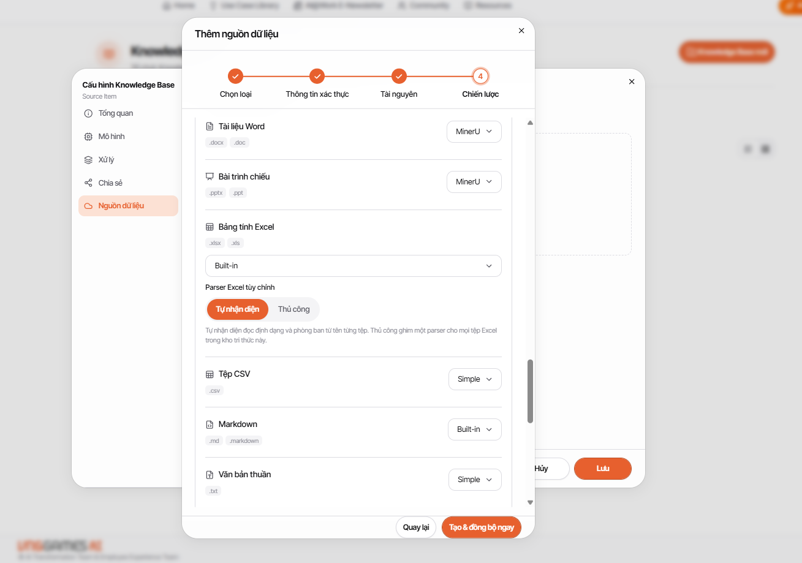

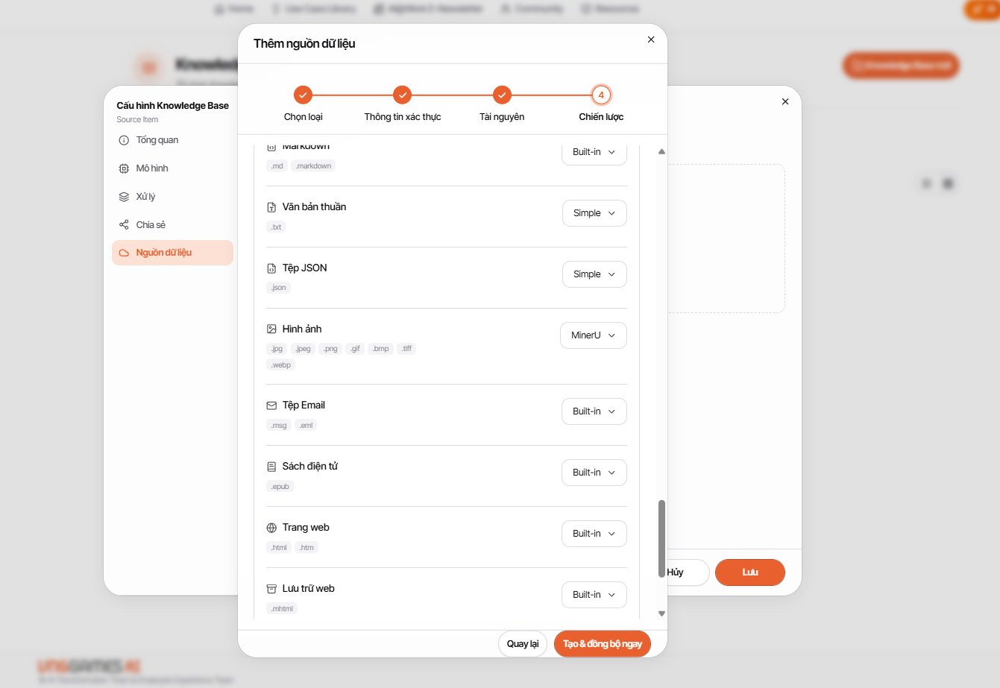

Danh sách parser quan sát được trong lượt này:

| Loại | Parser đang hiển thị |
|---|---|
| PDF, Word, PowerPoint | MinerU |
| Excel | Built-in; tự nhận diện hoặc thủ công |
| CSV, TXT, JSON | Simple |
| Markdown | Built-in |
| Ảnh | MinerU |
| Email, EPUB, HTML/HTM, MHTML, âm thanh | Built-in |

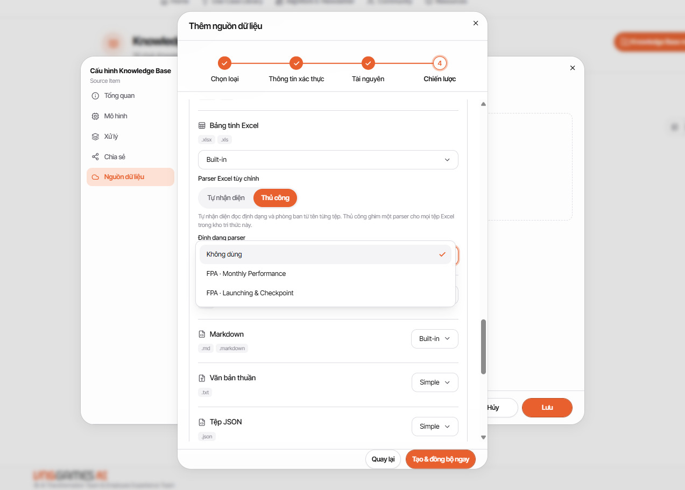

Khi chọn Excel **Thủ công**, tenant test hiển thị `Không dùng` và hai parser có tiền tố `FPA`. Đây là cấu hình riêng của tenant, không được ghi như mặc định chung của sản phẩm.

### Đồng bộ xóa

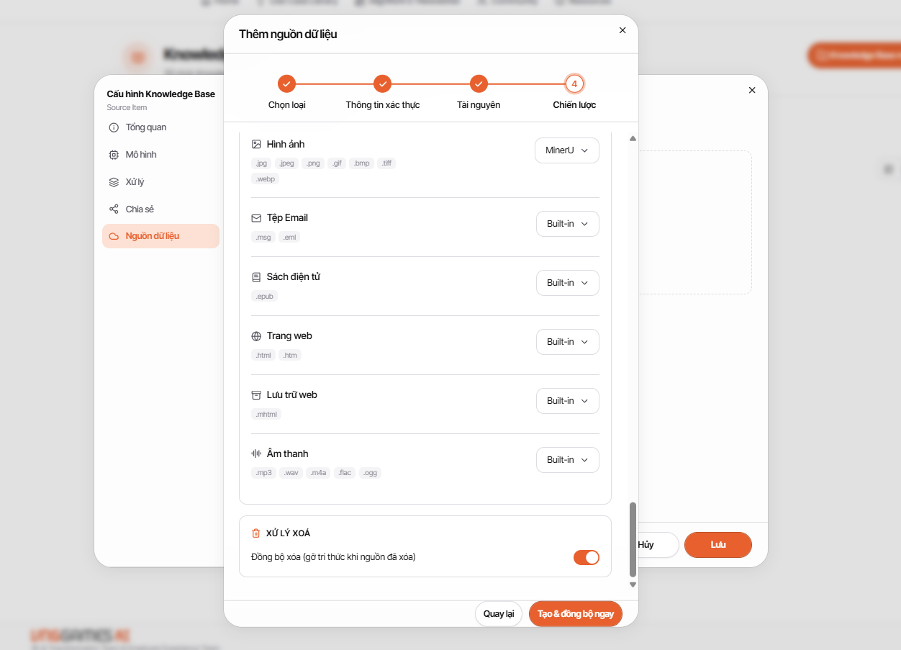

UI mô tả bật **Đồng bộ xóa** sẽ gỡ tri thức khi nguồn đã xóa. Lượt kiểm chứng này chỉ quan sát control; chưa thực hiện phép thử xóa đối chứng.

## 5. Kết quả lượt đồng bộ đầu tiên

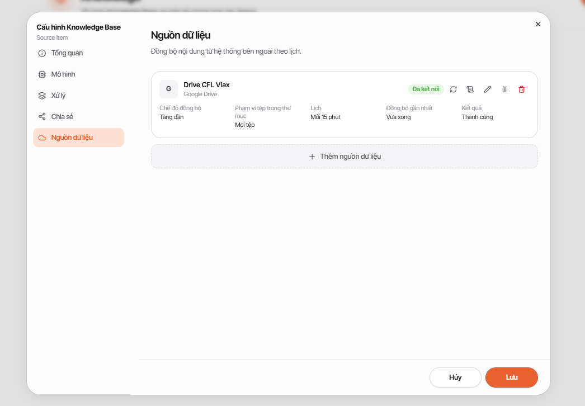

Card nguồn dữ liệu sau khi tạo hiển thị:

- Trạng thái: **Đã kết nối**.
- Chế độ đồng bộ: **Tăng dần**.
- Phạm vi: **Một tệp**.
- Lịch: **Mỗi 15 phút**.
- Đồng bộ gần nhất: **Vừa xong**.
- Kết quả: **Thành công**.

Kết quả này xác nhận wizard Google Drive bước 3-4 và lượt đồng bộ đầu tiên hoạt động trong điều kiện test. Nó chưa chứng minh mọi chiến lược hoặc parser đều cho kết quả đúng với mọi loại tệp.

## 6. Trạng thái backlog

| Hạng mục | Trạng thái 07/08/2026 |
|---|---|
| Xác thực service account và My Drive | Đã kiểm chứng |
| Bước 3 - chọn tài nguyên | Đã kiểm chứng |
| Bước 4 - giao diện chiến lược | Đã kiểm chứng |
| Tạo nguồn và lượt đồng bộ đầu tiên | Đã kiểm chứng, kết quả Thành công |
| Incremental/full qua nhiều chu kỳ | Chưa xác định |
| Regex, tag, parser tùy chỉnh trên dữ liệu đối chứng | Chưa xác định |
| Sửa, đổi tên, di chuyển, xóa, thu hồi quyền | Chưa xác định |
| Notion và NAS bước 3-4 | Chưa kiểm chứng |

## 7. Bảo mật và giới hạn

- JSON key là secret; không đưa vào Drive nguồn, KB, Markdown, ảnh hoặc Git.
- Chỉ cấp Viewer cho thư mục cần đồng bộ; không chia sẻ toàn bộ My Drive.
- Không chọn thư mục chứa key hoặc credential.
- Tên parser `FPA` và tên tệp trong ảnh chỉ là ví dụ tenant.
- Shared Drive chưa được kiểm chứng trong lượt này; trường ID để trống vì dùng My Drive.

